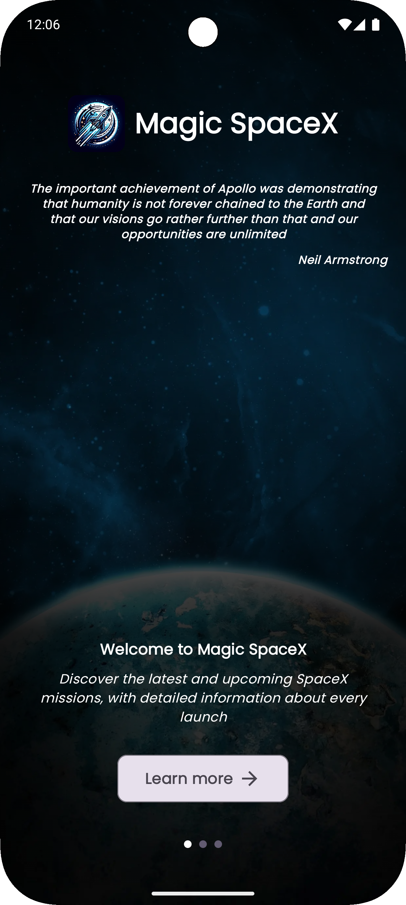
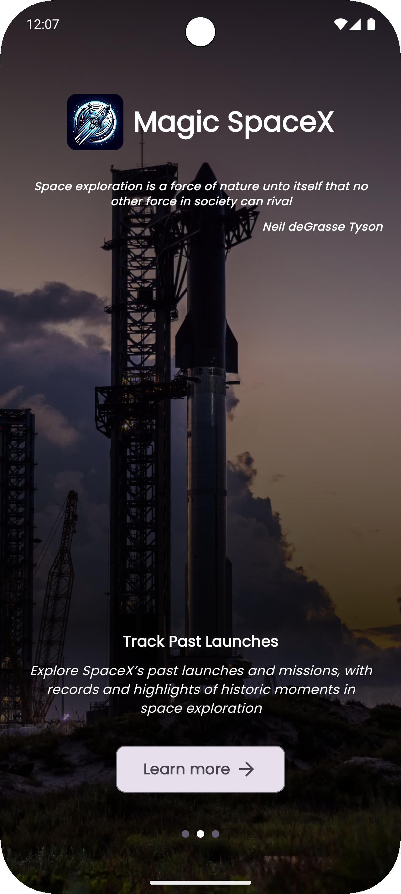
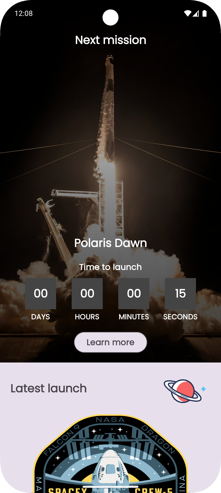
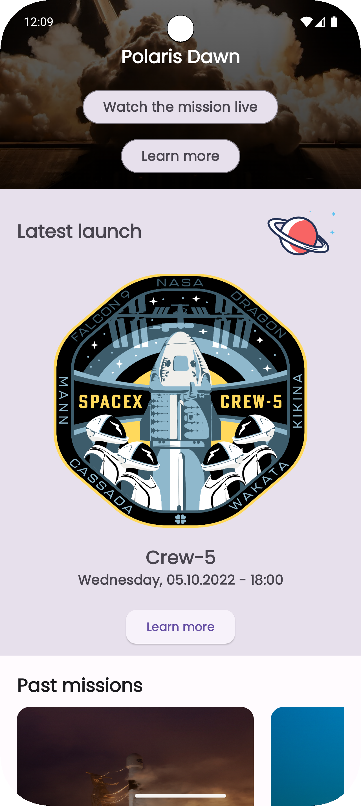
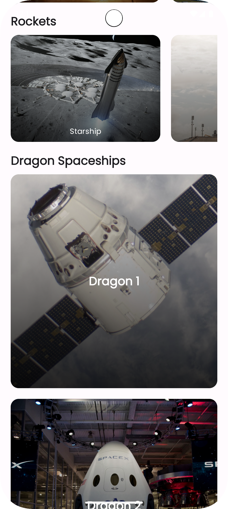
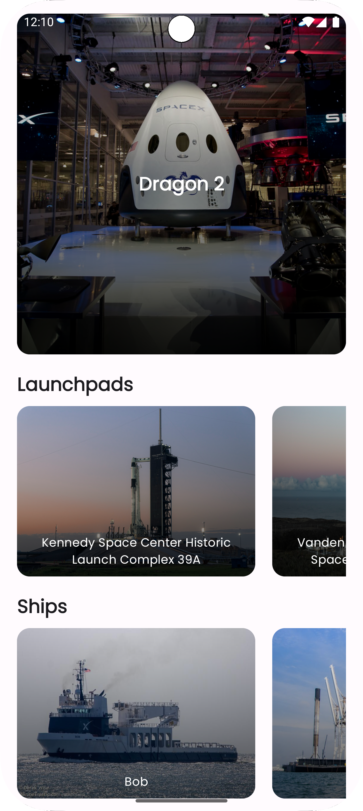
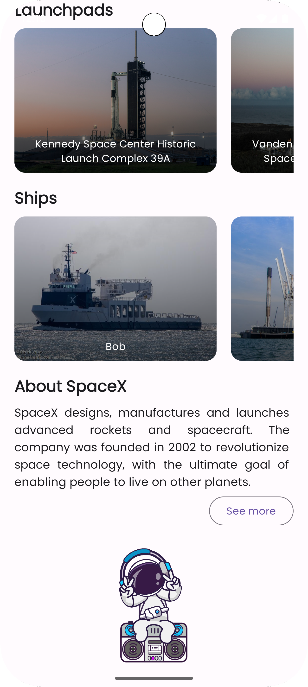
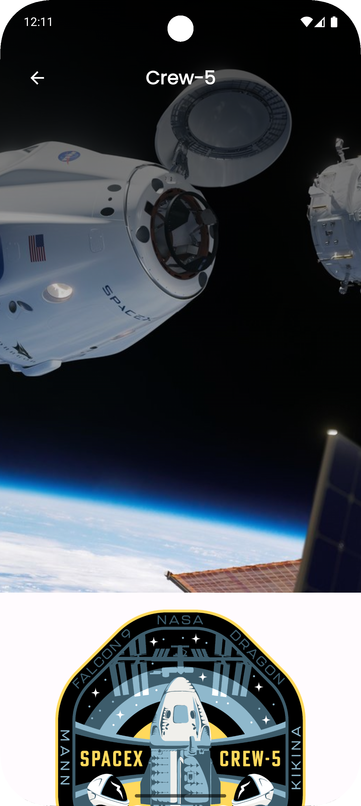
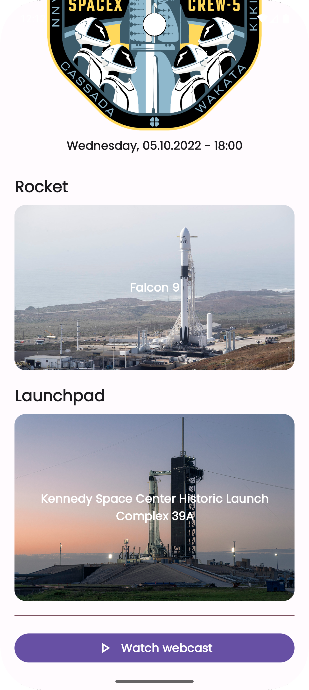

# Magic-SpaceX 📱

Magic-SpaceX is an Android application built with Jetpack Compose that brings the exciting world of
SpaceX to your fingertips. It fetches data from the public SpaceX API (v4) and displays it in a
clean, modern and intuitive user interface built with Material 3. Explore information about
launches, rockets, company details, and much more.

## 📸 Screenshots

### Introduction section

<table>
  <tr>
    <td></td>
    <td></td>
  </tr>
</table>

### Home section

<table>
  <tr>
    <td></td>
    <td></td>
  </tr>
  <tr>
    <td></td>
    <td></td>
  </tr>
  <tr>
    <td></td>
    <td></td> <!-- Empty cell if you have an odd number -->
  </tr>
</table>

### Launches section

<table>
  <tr>
    <td></td>
    <td></td>
  </tr>
</table>

## ✨ Features

* **Browse SpaceX Data:**
    * **Launches:** View past and upcoming SpaceX launches with details like mission name, date,
      rocket, launch site, and mission patch. You can also jump directly into the spacex webcast to
      watch the mission live on Youtube.
    * **Rockets:** Get information about SpaceX's fleet of rockets (e.g., Falcon 9, Falcon Heavy,
      Starship) including specifications, images, and first flight details.
    * **Company Information:** Learn more about SpaceX as a company.
* **Modern UI:** Built entirely with Jetpack Compose and Material 3 for a reactive, beautiful, and
  up-to-date user experience. Screens feature also rich lottie animations to give the app a more
  dynamic feel.
* **Dynamic Data:** Information is fetched live from the SpaceX API, ensuring you get the latest
  updates.
* **Image Loading:** Efficiently displays relevant images such as rocket pictures and mission
  patches using Coil.
* **Permissions Handling:** Utilizes Accompanist Permissions for a smooth in-app permission request
  flow.

## 🛠️ Tech Stack & Libraries

This project utilizes a modern Android development stack:

* **Kotlin:** Primary programming language.
* **Jetpack Compose with Compose Navigation:** For building the native UI.
* **Coroutines:** For asynchronous operations and managing data streams.
* **Networking:**
    * Retrofit: A type-safe HTTP client for Android and Java.
    * OkHttp: Underlying HTTP client for Retrofit.
    * Kotlinx Serialization: For parsing JSON responses from the API and creating Kotlin data
      classes.
* **Dependency Injection:**
    * Hilt
* **Image Loading:**
    * Coil: An image loading library for Android backed by Kotlin Coroutines.

## 📋 Prerequisites

* Android Studio (latest stable version recommended - e.g. Meerkat or newer)
* An Android device or emulator running Android 11 or later - API level 30+ (`minSdk = 30`)

## 🚀 Building and Running

1. **Clone the repository:**
   ```bash
   git clone [https://github.com/AdiJr/Magic-SpaceX.git](https://github.com/AdiJr/Magic-SpaceX.git)
   ```
2. **Open in Android Studio:**
    * Open Android Studio.
    * Click on "Open" or "Open an Existing Project".
    * Navigate to the cloned `Magic-SpaceX` directory and select it.
3. **Let Android Studio sync and build the project:**
    * This might take a few minutes as it downloads dependencies and sets up the project.
4. **Run the app:**
    * Select an emulator or connect an Android device (API 30+).
    * Click the "Run" button (▶️) in Android Studio.

## ⚙️ Continuous Integration & Automation (CI/CD)

This project uses **GitHub Actions** for CI/CD automation:

* `pull-request.yml`: This workflow triggers on pushes and pull requests to the `main` and
  `development` branches. It performs:
    * Running unit tests.
    * Running linters - android default linter and Kotlin [Detekt](https://github.com/detekt/detekt)
      to ensure code quality.
    * Running [MobSF](https://github.com/MobSF/Mobile-Security-Framework-MobSF) code analysis to
      check for security vulnerabilities in the codebase.
    * Building the app to check if there are no build errors.

* `dependabot.yml`: This workflow
  leverages [Dependabot](https://docs.github.com/en/code-security/dependabot)
  to help keep dependencies up to date by automatically creating pull requests for dependency
  updates.
  It runs on a schedule (every 7 days) and can also be triggered manually.

You can view the status of these workflows in the "Actions" tab of the GitHub repository.

## 📊 Data Source

This application uses the
public [SpaceX API v4](https://github.com/r-spacex/SpaceX-API/tree/master/docs/v4) as the main data
source.
